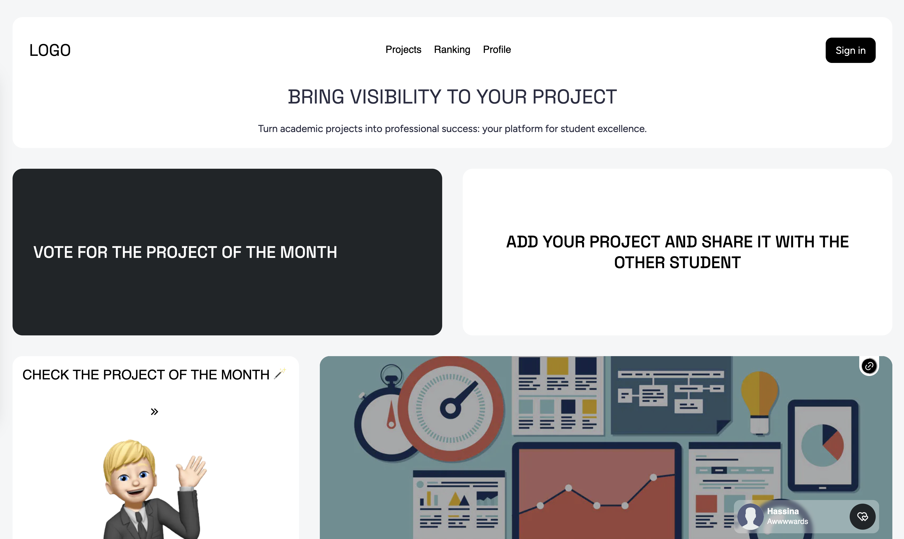

# RiiWARD

- [RiiWARD](#riiward)
  - [1. Description](#1-description)
  - [2. Screenshot](#2-screenshot)
  - [3. Diagram and architecture](#3-diagram-and-architecture)
    - [3.1 Diagram](#31-diagram)
    - [3.1.1 Diagram explaination](#311-diagram-explaination)
    - [3.2 Architecture](#32-architecture)
  - [4. Requirements](#4-requirements)
  - [5. How to Install](#5-how-to-install)
    - [5.1 Clone the Repository](#51-clone-the-repository)
    - [5.2 Install Dependencies](#52-install-dependencies)
    - [5.3 Set Environment Variables](#53-set-environment-variables)
    - [5.4 Run the Project](#54-run-the-project)
  - [6. Tests](#6-tests)
  - [7. Stack](#7-stack)
    - [7.1 Script \& Logic](#71-script--logic)
    - [7.2 JS Framework](#72-js-framework)
    - [7.3 Style](#73-style)
    - [7.4 DB](#74-db)
    - [7.5 Tools](#75-tools)
    - [7.6 Test](#76-test)
    - [7.7 Lint and Format](#77-lint-and-format)
    - [7.8 Useful](#78-useful)
  - [8 How to Contribute](#8-how-to-contribute)
    - [8.1 Thanks](#81-thanks)
    - [8.2. Review the Contributing Guidelines](#82-review-the-contributing-guidelines)
    - [8.3. Explore Open Issues](#83-explore-open-issues)
    - [8.4. Submit an Issue](#84-submit-an-issue)
    - [8.5 Make a Pull Request](#85-make-a-pull-request)
      - [8.5.1 Here's how to submit a pull request:](#851-heres-how-to-submit-a-pull-request)
    - [8.6. Await Feedback](#86-await-feedback)
  - [9. Code of Conduct](#9-code-of-conduct)

[](https://opensource.org/licenses/MIT)


## 1. Description


Transforms academic projects to professional success.

## 2. Screenshot



## 3. Diagram and architecture

### 3.1 Diagram


### 3.1.1 Diagram explaination

- **User Interface**: The entry point for users interacting with the application, including navigating through different pages and triggering actions.
- **Pages**: Defined using Next.js, each page component corresponds to a route in the application.
- **Routing (Next.js)**: Handles the application's routing, dynamically loading the appropriate page components based on the URL.
- **Layouts**: Reusable layout components that define the common structure of pages (e.g., header, footer).
- **Components**: Reusable UI components used within pages and layouts, such as buttons, input fields, and cards.
- **Contexts/Hooks**: Utilized for managing application state and logic, sharing data across components.
- **Services**: Functions or classes that handle external API calls, interacting with databases or other services.
- **Supabase Database**: The backend database where application data is stored and retrieved.
- **Styled Components**: Enables CSS-in-JS styling, allowing each component to have its encapsulated style.

### 3.2 Architecture

- **assets**: Static files like images, fonts, and other media.
- **components**: Reusable UI components.
- **contexts**: React context providers for state management.
- **hooks**: Custom React hooks for shared logic.
- **layouts**: Components that define different page layouts.
- **pages**: Components representing individual pages, likely routed in Next.js.
- **screens**: Larger components or containers that may compose multiple components.
- **services**: Functions or classes for interacting with external services or APIs.
- **styles**: Global stylesheets or theme-related styling.
- **themes**: Theming configurations or definitions.

## 4. Requirements

- [Node.js LTS](https://nodejs.org/en): Essential for project execution.

## 5. How to Install

### 5.1 Clone the Repository

```bash
git clone git@github.com:ImJustLucas/RiiWARD.git
```

### 5.2 Install Dependencies

```bash
cd RiiWARD
npm install
```

### 5.3 Set Environment Variables

Create a `.env` file in the root of the project and add the following environment variables:

```env
NEXT_PUBLIC_SUPABASE_KEY=''
NEXT_PUBLIC_SUPABASE_URL=''
```

Please replace the empty strings with your Supabase credentials.

### 5.4 Run the Project

```bash
npm run dev # Navigate to localhost:3000
```

## 6. Tests

```bash
npm test
```

## 7. Stack

### 7.1 Script & Logic

- [🟡 JavaScript](https://developer.mozilla.org/en/docs/Web/JavaScript): Core programming language.

### 7.2 JS Framework

- [🔵 React](https://reactjs.org/): User interface library.
- [⚡ Next.js](https://nextjs.org/): React framework for SSR and SSG.

### 7.3 Style

- [🎨 Styled Components](https://styled-components.com/): CSS in JS library.
- [✨ Remixicon](https://remixicon.com/): Open source icon library.

### 7.4 DB

- [📚 Supabase](https://supabase.com/): Firebase alternative, database, auth.

### 7.5 Tools

- [📄 TypeScript](https://www.typescriptlang.org/): JavaScript with types.
- [🐶 Husky](https://github.com/typicode/husky): Pre-commit hooks tool.
- [🚫 Lint-staged](https://www.npmjs.com/package/lint-staged): Linters for staged files.

### 7.6 Test

- [📊 Jest](https://jestjs.io/): JavaScript testing framework.

### 7.7 Lint and Format

- [📏 ESLint](https://eslint.org/): JavaScript linter.
- [💖 Prettier](https://prettier.io/): Code formatter.

### 7.8 Useful

- [⏲ Dayjs](https://day.js.org/): Lightweight date library.
- [📝 Sonner](https://github.com/need-to-change): \*\* Toast notification component.

This concise structure ensures clarity in describing the technology stack within the specified constraint.

## 8 How to Contribute

### 8.1 Thanks

Thank you for your interest in contributing to RiiWARD! To ensure a smooth contribution process for everyone involved, we kindly ask you to follow these steps:

### 8.2. Review the Contributing Guidelines

Before starting, please review our [Contributing Guidelines](CONTRIBUTING.md). This document provides essential information on how to report issues, propose feature enhancements, and submit pull requests. Adhering to these guidelines helps maintain the project's quality and coherence.

### 8.3. Explore Open Issues

Visit our issues page to find open tasks. Whether you're looking to tackle a bug, add a new feature, or improve documentation, our issues list is the best place to start. If you're new to the project, look for issues labeled `good first issue` or `help wanted` — these are great entry points for new contributors.

### 8.4. Submit an Issue

If you've encountered a bug or have a suggestion for a new feature that isn't already listed, please submit a new issue. Provide a clear and concise description, including any relevant details or examples. This helps us understand your proposal or the problem you're facing.

### 8.5 Make a Pull Request

Found something you'd like to work on? Awesome! If it's a small fix or improvement, feel free to start coding. For larger contributions or significant changes, it's best to discuss your ideas with the project maintainers first. This ensures your efforts align with the project's direction and goals.

#### 8.5.1 Here's how to submit a pull request:

- **Fork the Repository:** Click the 'Fork' button on the repository page to create a copy under your GitHub account.
- **Clone Your Fork:** Clone the repository to your local machine using Git.
- **Create a New Branch:** Use a branch name that describes the feature or fix you're implementing (e.g., `fix-login-bug` or `add-user-profile`).
- **Implement Your Changes:** Work on your changes, ensuring they adhere to the project's coding standards and guidelines.
- **Run Tests:** If the project includes tests, run them to ensure your changes don't introduce any new issues.
- **Commit Your Changes:** Write clear, concise commit messages that follow any project-specific guidelines.
- **Push to Your Fork:** Push your changes to your GitHub fork.
- **Submit a Pull Request:** Go to the original project's repository and click the 'New pull request' button. Select your branch and provide a detailed description of your changes.

### 8.6. Await Feedback

Once your pull request is submitted, the project maintainers will review your contribution. Be open to feedback and ready to make adjustments if needed. Your contribution will be merged into the project once it meets the project standards and has been approved by the maintainers.

Your contributions, big or small, play a significant role in the success and improvement of RiiWARD. We look forward to your ideas and efforts to make this project even better. Thank you for contributing!

## 9. Code of Conduct

Everyone interacting in the dbt project's codebases, issue trackers, chat rooms, and mailing lists is expected to follow the dbt [Code of Conduct](CODE_OF_CONDUCT.md).
